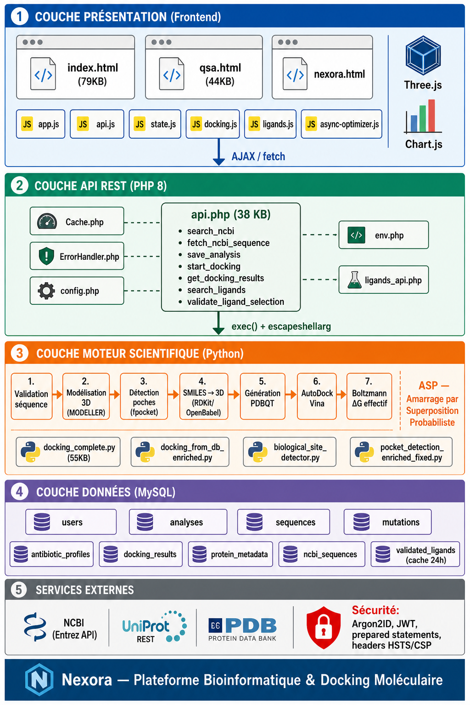

# <p align="center"><br>N3XORA v2.0 — Bioinformatics Platform</p>

<p align="center">
  
  
  
  
  
  
</p>

---

## 🔬 Overview

**Nexora v2.0** is an advanced, fully dockerized web platform dedicated to the bioinformatics analysis of DNA and RNA sequences, molecular docking simulations, and heuristic stability analyses (HSA; formerly mislabeled QSA). 

Designed as a bridge between molecular biology and modern software engineering, Nexora allows researchers and students to explore, analyze, and model genetic data in an intuitive, powerful, and visually immersive interface. With its updated **v2.0** distributed architecture, the application decouples heavy scientific computations from the user interface using asynchronous workers, providing a highly scalable and responsive experience.

---

## 🔮 Vision

In a world where biological data is growing exponentially, Nexora positions itself as a smart digital laboratory capable of:
1. **Decoding** the language of life through automated genomic acquisition and analysis.
2. **Anticipating** mutations and identifying potential bacterial resistance mechanisms.
3. **Simulating** molecular ligand-protein interactions directly in the web browser.
4. **Analyzing** environmental impacts on DNA stability using the heuristic HSA module; no quantum calculation is performed.

---

## 🚀 Main Features

### 1. Data Search and Acquisition (NCBI Entrez Integration)
* Direct integration with the NCBI databases via the Entrez API.
* Search and automatically download nucleotide sequences using Accession IDs.
* Local PostgreSQL caching system to prevent redundant API queries.


---

### 2. DNA / RNA Sequence Analysis
* Nucleotide frequency calculations (DNA: A, T, C, G | RNA: A, U, C, G).
* Automated mutation detection and variant reporting.
* Antibiotic resistance prediction based on known genomic signatures.
* Sequence distribution plotting with interactive charts (**Chart.js**).


---

### 3. Transcription & Translation
* Immediate DNA to mRNA transcription.
* mRNA to Protein (peptide chain) translation.
* Codon frequency and identification tables.


---

### 4. Molecular Docking (Powered by AutoDock Vina & RDKit)
* **Asynchronous Docking Jobs**: Submits docking simulations to dedicated background Celery workers, allowing the interface to remain perfectly responsive.
* **Pre-seeded Ligand Examples**: A library of approximately 30 example molecules ready for docking; their presence does not constitute experimental validation.
* **Chemical Properties Engine**: Uses **RDKit** to compute molecular descriptors in real time (Molecular weight, LogP, Hydrogen Bond Donors/Acceptors, Topological Polar Surface Area (TPSA), Lipinski's Rule of 5 compliance).
* **3D Visualization**: Render ligand-protein docking poses using **Three.js** and **OrbitControls**.
* **Structure input**: The lightweight mode uses an administrator-provided PDB. ColabFold/AlphaFold2 is optional and requires a separate heavyweight profile.
* **Scientific interpretation**: Vina scores are empirical; ASP is post-processing and is not an experimental binding free energy.


---

### 5. Heuristic Stability Analysis (HSA)
* Conceptual DNA stability simulation model inspired by composition-based heuristics and environmental factors (pedagogical proxy).
* Evaluates genomic sequence vulnerability against environmental factors such as temperature, pH, radiation, and chemical exposure.
* Computes mutation predictability, highlighting fragile zones, mutation types, and overall stability scores.


---

## 🏛️ System Architecture

Nexora v2.0 is built on a containerized, event-driven, and micro-orchestrated architecture:

```
                        [ Client Browser ]
                                │
                                ▼ (Port 80)
                         [ Nginx Web Proxy ]
                         ├── / -> Static Frontend (HTML5 / CSS / Vanilla JS)
                         └── /api/ -> [ FastAPI Backend ] (Port 8000)
                                           │
                        ┌──────────────────┴──────────────────┐
                        ▼                                     ▼
             [ PostgreSQL 16 DB ]                   [ Redis Task Broker ]
             (Port 5434 -> 5432)                     (Port 6381 -> 6379)
                        │                                     │
                        │                                     ▼
                [ Schema & Seed ]                   [ Celery Worker Queue ]
               (Validated Ligands)                 (Docking, heavy Analysis, HSA)
                                                              │
                                                              ▼
                                                    [ Celery Flower Monitor ]
                                                           (Port 5555)
```

---

## 🛠️ Tech Stack

* **Frontend**:
  * Modern HTML5 / Vanilla CSS3 (Custom design, dark mode, responsive).
  * JavaScript ES6 (Modular structure without bulky frameworks).
  * **Three.js**: Interactive 3D molecular renderer.
  * **Chart.js**: Analytical data visualization.
* **Backend**:
  * **FastAPI** (Python 3.12): High-performance asynchronous API, auto-documented with OpenAPI / Swagger.
  * **Celery**: Asynchronous tasks processing (Docking, HSA, and large-sequence analysis).
  * **Redis 7**: Fast caching layer and message broker for Celery queues.
  * **PostgreSQL 16**: Relational storage (configured with custom indices and fuzzy matching via `pg_trgm`).
* **Bioinformatics and Cheminformatics Engines**:
  * **AutoDock Vina 1.2.5**: Molecular docking solver.
  * **Biopython 1.83**: Nucleotide sequence handler and NCBI connection client.
  * **RDKit 2024**: Cheminformatics descriptor calculations.

---

## ⚙️ Installation and Setup (Docker)

### 1. Prerequisites
Ensure you have the following installed on your machine:
* [Docker](https://docs.docker.com/get-docker/)
* [Docker Compose](https://docs.docker.com/compose/install/)

### 2. Configure Environment
Copy the example environment configuration:
```bash
cp .env.example .env
```
Edit the `.env` file to customize settings:
* Set your `NCBI_EMAIL` for NCBI Entrez query compliance.
* Change default credentials (`DB_PASSWORD`, `SECRET_KEY`) for production environments.

### 3. Build & Run
Launch the entire system in the background:
```bash
docker compose up --build -d
```

### 4. Port Map Summary
* 🖥️ **Web Application (Frontend)**: [http://localhost](http://localhost)
* 📖 **API Docs (Swagger)**: [http://localhost/docs](http://localhost/docs)
* 🌸 **Task Monitor (Celery Flower)**: [http://localhost:5555](http://localhost:5555)
* 🗄️ **Database (PostgreSQL)**: Port `5434` (mapped to `5432` in containers).
* 🔴 **Cache Broker (Redis)**: Port `6381` (mapped to `6379` in containers).

---

## 🔒 Security & Performance Features
* **Security Logs & Rate Limiting**: The `login_attempts` table records failed authentication instances to prevent brute force attacks.
* **Password Hashing**: Done securely with **bcrypt**; API session management uses **JWT** tokens.
* **Dedicated Task Queues**: Celery splits background tasks into separate queues (`docking`, `analysis`, `qsa`) so that long-running molecular simulations never choke the standard API requests.

---

## 🤝 Contribution

1. Fork the repository.
2. Create a feature branch (`git checkout -b feature/amazing-feature`).
3. Commit your changes (`git commit -m 'Add some amazing feature'`).
4. Push to the branch (`git push origin feature/amazing-feature`).
5. Open a Pull Request.

---

## 📝 License

This project is licensed under the **GPL (General Public License)**. See the [LICENSE](LICENSE) file for more details.

---

### ⚠️ Scientific Disclaimer
*Nexora is an experimental tool built for academic research and educational purposes. All computed binding energies and mutation predictability outcomes must be verified with in vitro and in vivo laboratory methods before any pharmaceutical, clinical, or diagnostic applications.*

- `RESEARCH_PHASE7_VIRTUAL_SCREENING.md` — protocole de virtual screening contrôlé.
